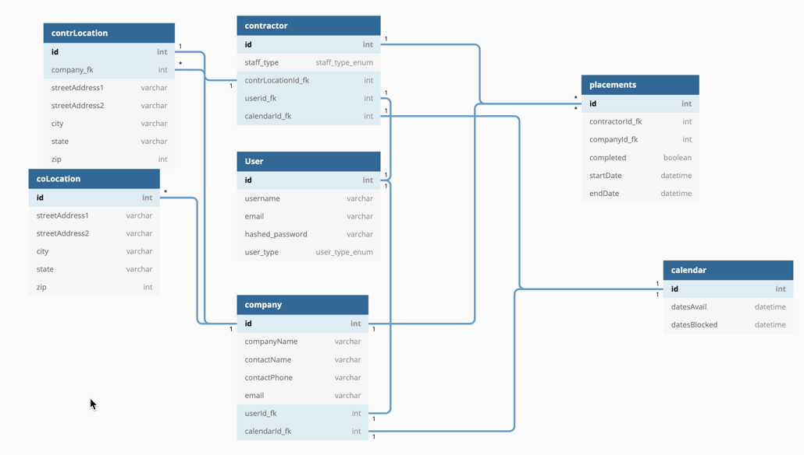

# Flask React Project

This is the backend for the Flask React project.

## Getting started

1. Clone this repository (only this branch)

   ```bash
   git clone https://github.com/appacademy-starters/python-project-starter.git
   ```
2. Install dependencies

   ```bash
   pipenv install --dev -r dev-requirements.txt && pipenv install -r requirements.txt
   ```
3. Create a **.env** file based on the example with proper settings for your
   development environment

   ```bash

   ```
4. Setup your PostgreSQL user, password and database and make sure it matches your **.env** file

   ```
   CREATE USER scheduler_user WITH CREATEDB PASSWORD 'password;
   CREATE DATABASE scheduler WITH OWNER scheduler_user;
   ```
5. Create your database models:
   

   Created by https://dbdiagram.io/d/5fc7dbf93a78976d7b7e436:

   ```bash
   //// -- Enums
   Enum staffType_enum {
     dentist
     dentalHygenist
     dentalAssistant
     frontOffice
     backOffice
   }

   Enum userType_enum {
     admin
     company
     contractor
   }

   //// -- Tables and References
   Table User as U {
     id int [pk, increment]
     username varchar
     email varchar
     hashed_password varchar
     userType userType_enum
   }

   Table contractor as C {
     id int [pk, increment] // auto-increment
     staffType staff_type_enum
     contrLocationId_fk int [ref: - CL.id]
     userid_fk int [ref: - U.id]
     calendarId_fk int [ref: - Cal.id]
   }

   Table contrLocation as CL {
     id int [pk, increment]
     company_fk int [ref: > Co.id]
     streetAddress1 varchar
     streetAddress2 varchar
     city varchar
     state varchar
     zip int
   }

   Table coLocation as OL {
     id int [pk, increment]
     streetAddress1 varchar
     streetAddress2 varchar
     city varchar
     state varchar
     zip int
   }
   Ref: Co.id < OL.id

   Table calendar as Cal {
     id int [pk, increment]
     datesAvail datetime
     datesBlocked datetime
   }

   Table company as Co {
     id int [pk, increment]
     companyName varchar
     contactName varchar
     contactPhone varchar
     email varchar
     userId_fk int [ref: - U.id]
     calendarId_fk int [ref: - Cal.id]
   }


   Table placements as P {
     id int [pk, increment]
     contractorId_fk int
     companyId_fk int
     completed boolean
     startDate datetime
     endDate datetime
   }
   Ref: C.id < P.id
   Ref: Co.id < P.id
   ```
6. Get into your pipenv, migrate your database, seed your database, and run your flask app

   ```bash
   pipenv run flask db init #create migration folder and files
   pipenv run flask db migrate -m <fileName> #creates the
                              # alembic files and
                              # migrations dir.
   pipenv run flask db upgrade #updates the database
   ```
7. ```bash
   pipenv shell
   ```

   ```bash
   flask db upgrade
   ```

   ```bash
   flask seed all
   ```

   ```bash
   flask run
   ```
8. To run the React App in development, checkout the [README](./react-app/README.md) inside the `react-app` directory.

---

*IMPORTANT!*
If you add any python dependencies to your pipfiles, you'll need to regenerate your requirements.txt before deployment.
You can do this by running:

```bash
pipenv lock -r > requirements.txt
```

*ALSO IMPORTANT!*
psycopg2-binary MUST remain a dev dependency because you can't install it on apline-linux.
There is a layer in the Dockerfile that will install psycopg2 (not binary) for us.

---

## Deploy to Heroku

1. Create a new project on Heroku
2. Under Resources click "Find more add-ons" and add the add on called "Heroku Postgres"
3. Install the [Heroku CLI](https://devcenter.heroku.com/articles/heroku-command-line)
4. Run

   ```bash
   heroku login
   ```
5. Login to the heroku container registry

   ```bash
   heroku container:login
   ```
6. Update the `REACT_APP_BASE_URL` variable in the Dockerfile.
   This should be the full URL of your Heroku app: i.e. "https://flask-react-aa.herokuapp.com"
7. Push your docker container to heroku from the root directory of your project.
   This will build the dockerfile and push the image to your heroku container registry

   ```bash
   heroku container:push web -a {NAME_OF_HEROKU_APP}
   ```
8. Release your docker container to heroku

   ```bash
   heroku container:release web -a {NAME_OF_HEROKU_APP}
   ```
9. set up your database:

   ```bash
   heroku run -a {NAME_OF_HEROKU_APP} flask db upgrade
   heroku run -a {NAME_OF_HEROKU_APP} flask seed all
   ```
10. Under Settings find "Config Vars" and add any additional/secret .env variables.
11. profit
