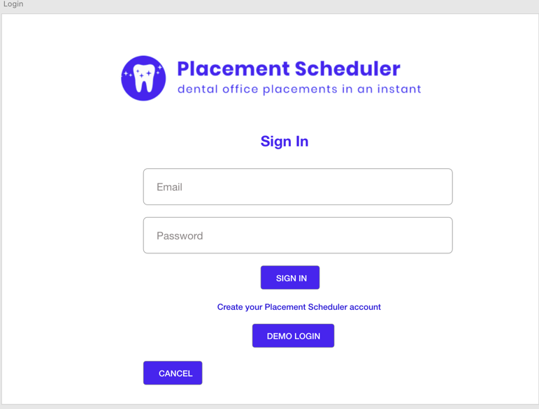
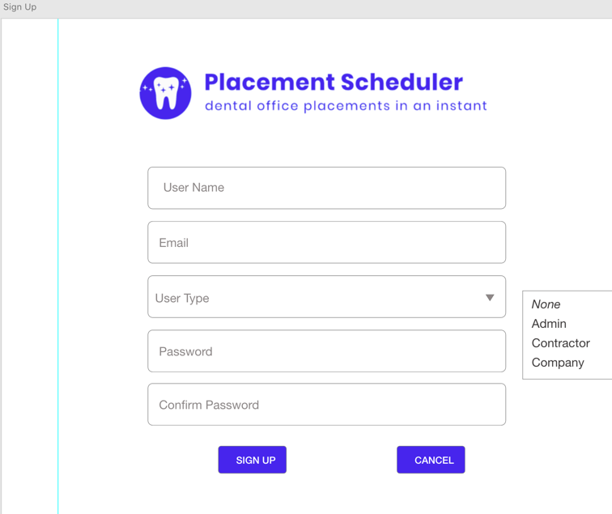
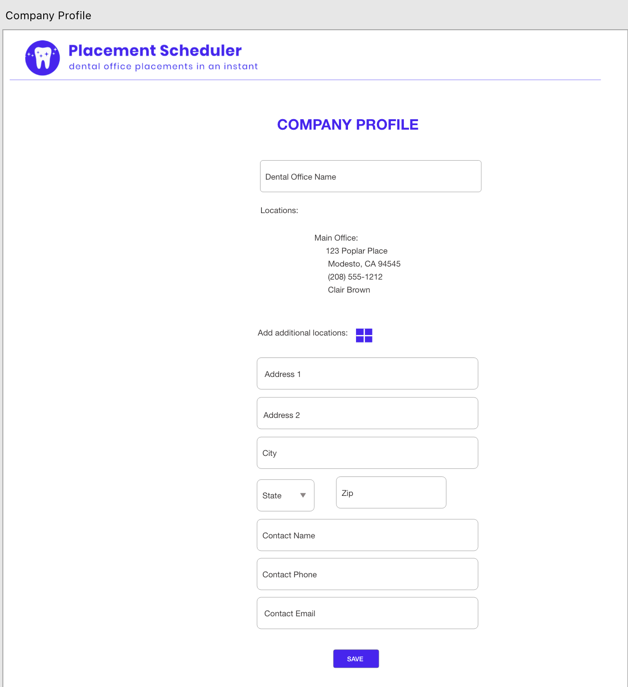
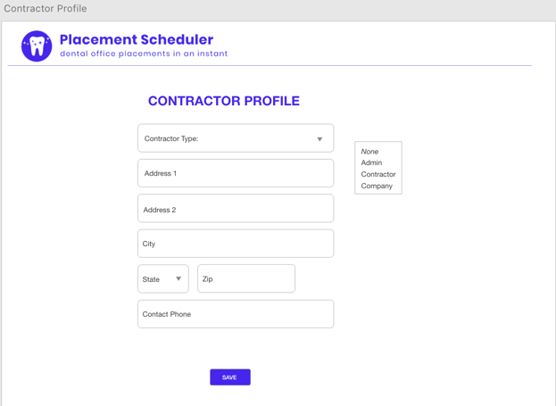
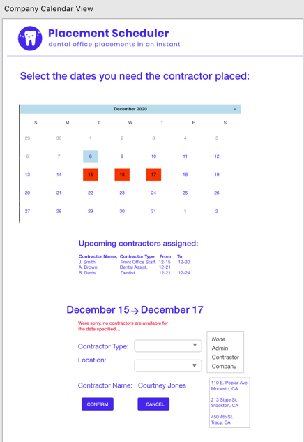
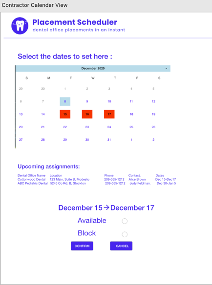
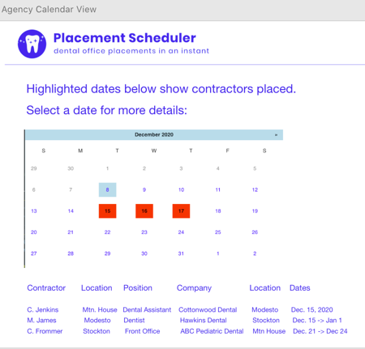
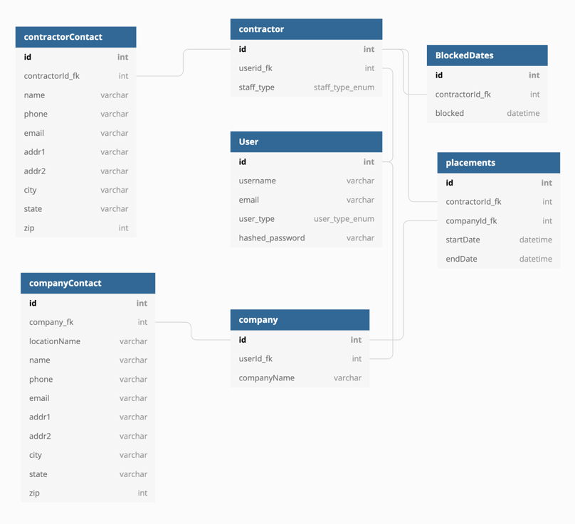

# Flask React Project - Placement Scheduler

Placement Scheduler is an agency/contractor placement application.  Three distinct accounts are used:  agency, contractor, company.

This automated system matches contractors with companies in need of assistance in real-time.

The contractor marks their schedules as open, the company creates their request for the type of employee they desire as well as the dates required, and the agency may view the placements made, gaining an insight into how their placements are being utilized.

# Routes Needed

## Backend Route

1. '/company/$ {id}'

   1. POST:  Company Profile is updated with location information.
      Takes the following object and updates two tables:  company and coLocation:

      ```bash
      { companyName, addr1, addr2, city, state, zip, contactName, contactPhone }
      ```
   2. GET:  Company profile information populated in web form.
      Returns the following object from company and coLocation:

      ```
      { id, companyName, location[{ addr1, addr2, city, state, zip, contactName, contactPhone}] }
      ```
2. 'contractor/${id}'

   1. POST: Contractor Profile information is posted.
      Takes the following object and updates contractor and contrLocation tables:
      ```{contractorId, staff_type, contrLocationId_fk, contrLocation: {streetAddress1, streetAddress2, city, state, zip, contactPhone}```
   2. GET:  Populates the Contractor Profile information.
      Returns the following object from contractor and contrLocation tables::
      ```{ id, contractorName, addr1, addr2, city, state, zip, phone }```
3. 'schedule/${id}/&lt;dateFrom-dateTo&gt;'

   1. POST:  Id in URL is companyId.  Company chooses contractor to work for them.
      Takes dateFrom-dateTo and splits on hyphen, then updates the placement table with the selected contractor id, dateFrom and dateTo rows, as well as adding the dateFrom to dateTo dates to the datesBlocked array of the contractor.
      Body of post request :
      ```{contractorId_fk}```
4. 'schedule/${id}/'

   1. GET:  Id is the Company Id.  Returns the schedule of placements made by the company:

   ```{placements: [ {id, contractorId, contractor:{ user.userName, user.email, street, companyId, startDate, endDate}
   {placements: [ {id, contractorId, contractor:{ user.userName, user.email, street, companyId, startDate, endDate}
   ```
5. 'schedule/\<user_type\>/\<dateFrom-dateTo\>'

   1. GET:  Returns all users of user type that are not blocked for any of the dates in the date range.
      ```bash
      { [user.username, user.email, contractor.id, contractor.staff_type, contrLocation: { streetAddress1, streetAddress2, city, state, zip, contactPhone }, contractor.datesBlockedArr]
      ```
6. 'schedule/'
7. GET:  Returns ALL users placed. This is for the agency to understand when placements occur.

   ```bash
   { [placements: {company: companyName, companyLocation: { coLocation.streetAddress1, coLocation.streetAddress2, coLocation.city, coLocation.state, coLocation.zip, coLocation.contactName, coLocation.contactEmail, coLocation.contactPhone} contractor: { contractor.id, contractor.staff_type contrLocation: { contrLocation.streetAddress1, contrLocation.streetAddress2, contrLocation.city, contrLocation.state, contrLocation.zip, contrLocation.contactPhone}} ]
   ```

   ## Frontend Routes
8. '/login'

   
9. '/sign-up'
   
10. '/companyProfile'
    
11. '/contractorProfile'
    
12. '/companyCalendar'
    
13. '/contractorCalendar'
    
14. '/agencyCalendar'
    

# Database Model

Database model is stored on https://dbdiagram.io/d/5fc7dbf93a78976d7b7e436b



```bash
//// -- Tables and References
Table User as U {
  id int [pk, increment]
  username varchar
  email varchar 
  hashed_password varchar 
  user_type user_type_enum
}

Table contractor as C {
  id int [pk, increment] // auto-increment
  staff_type staff_type_enum
  contrLocationId_fk int [ref: - CL.id]
  userid_fk int [ref: - U.id]
  datesBlockedArr datetime
}

Table contractorContact as CL {
  id int [pk, increment]
  streetAddress1 varchar
  streetAddress2 varchar
  city varchar
  state varchar
  zip int
  contactPhone varchar
}

Table companyContact as OL {
  id int [pk, increment]
  streetAddress1 varchar 
  streetAddress2 varchar 
  city varchar 
  state varchar 
  zip int 
  contactName varchar 
  contactPhone varchar
  contactEmail varchar
  company_fk int [ref: > Co.id]
}


Table company as Co {
  id int [pk, increment]
  companyName varchar
  userId_fk int [ref: - U.id]
  coLocation_fk int
}


Table placements as P {
  id int [pk, increment]
  contractorId_fk int [ref: >  C.id]
  companyId_fk int [ref: > Co.id]
  startDate datetime
  endDate datetime
}

```


1. 1. 3. 1. ```
